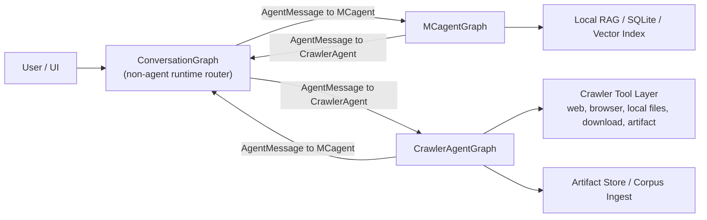
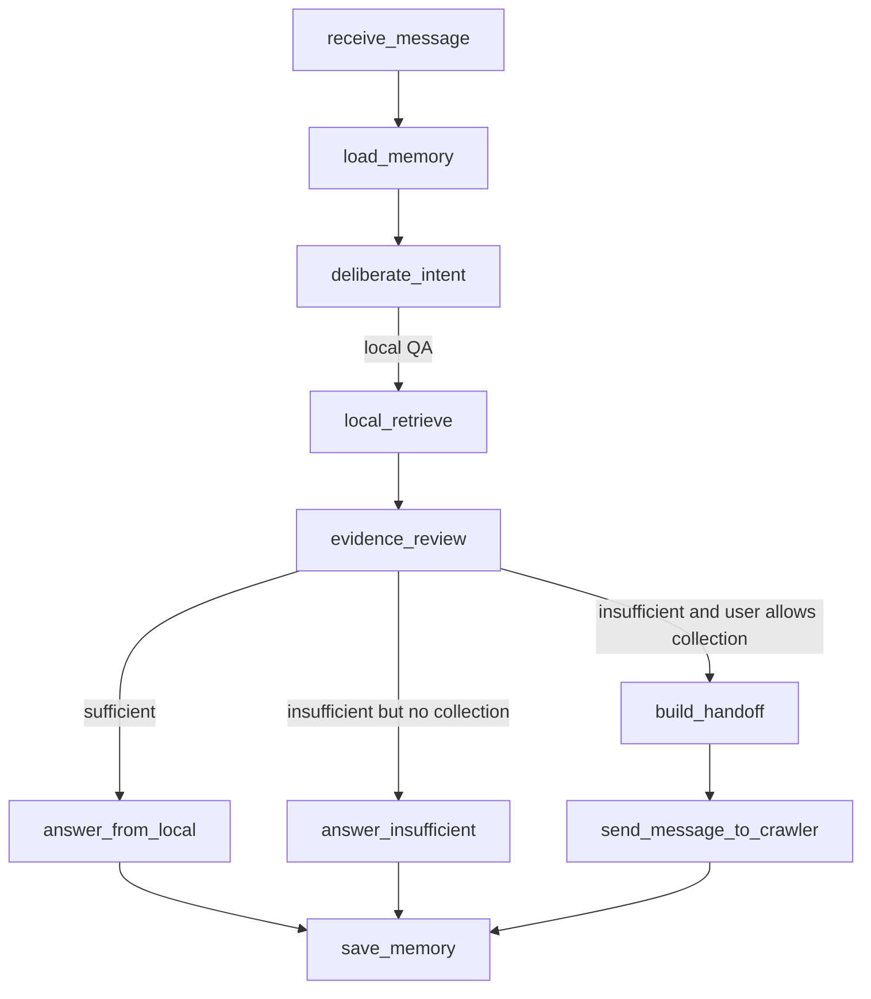
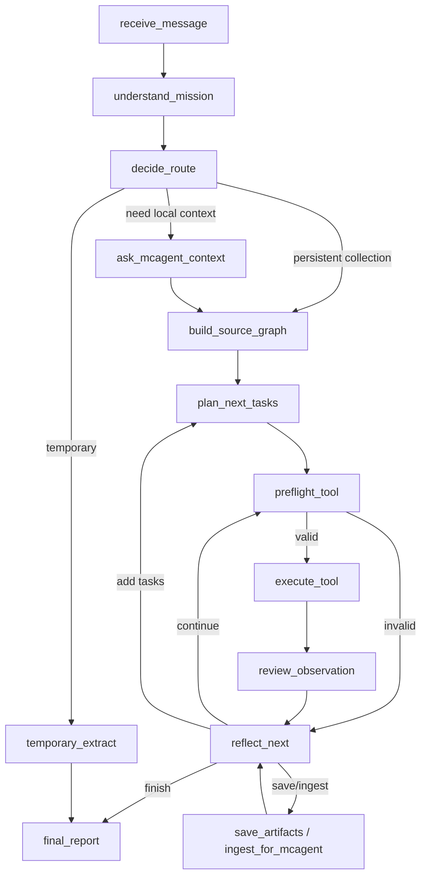

# LangGraph 双 Agent 架构开发文档

本文先脱离当前代码，从零定义一个理想的双 Agent 项目：`MCagent` 只基于本地资料问答，`CrawlerAgent` 可以接管本地环境、联网搜索、抓取、下载、读取和整理资料。两个 Agent 都使用 DeepSeek 这类 OpenAI-compatible 聊天模型，推理能力在线；系统目标不是用脚本替代 Agent，而是给 Agent 足够清晰的状态、工具、记忆和边界，让 LLM 自主选择、审核和反思。

最后一节会对照当前项目，指出它和理想 LangGraph 架构之间的问题。

## 参考依据

- LangGraph 官方多 Agent 文档强调：多 Agent 的核心价值包括上下文管理、分布式能力维护、并行化；常见模式包括 subagents、handoffs、router、custom workflow。对本项目来说，`MCagent <-> CrawlerAgent` 更接近 handoff + custom workflow，而不是一个中心 supervisor 管所有事情。参考：https://langchain-ai.github.io/langgraph/tutorials/multi_agent/multi-agent-collaboration/
- LangGraph 官方持久化文档强调：checkpointer 会在每个 graph step 保存状态，用于会话记忆、人类介入、时间旅行调试和容错恢复。参考：https://langchain-ai.github.io/langgraph/cloud/concepts/threads/
- LangGraph 记忆文档区分 thread-level short-term memory 与跨 thread 的 long-term store。参考：https://langchain-ai.github.io/langgraph/how-tos/memory/manage-conversation-history/
- LangGraph human-in-the-loop / interrupt 能力适合高风险工具调用前暂停、审批、恢复。参考：https://langchain-ai.github.io/langgraph/cloud/how-tos/human_in_the_loop_breakpoint/

## 总体原则

1. 两个 Agent 都必须是真 Agent：LLM 负责理解、工具选择、工具结果审核、下一步反思、最终表达。
2. 工具只提供客观观察：HTTP 状态、文本、文件路径、manifest、错误、下载大小、截图、DOM、数据库检索结果。工具不能替 Agent 说“接受/拒绝/够了/不够”。
3. 所有用户、MCagent、CrawlerAgent 的通信统一为 `AgentMessage(from_agent, content, to_agent, metadata)`。
4. `AgentMessage` 只是通信，不是工具调用。接收方收到消息后，必须进入自己的 LangGraph 节点流程，由自己的 LLM 决定下一步。
5. `MCagent` 的外部世界边界是本地资料库。它不能联网、不能抓取、不能下载，最多只能发消息请求 CrawlerAgent 补资料。
6. `CrawlerAgent` 是全领域采集 Agent，不是 MC 专用爬虫。Minecraft / modpack 工具只是它的一个工具组。
7. 所有副作用必须显式可见：写文件、下载、入库、启动后台任务、删除数据、覆盖文件都要出现在 graph state、trace、audit 中。
8. 每次工具执行后都要有 LLM 自审节点：工具展示事实，Crawler 决定是否接受、拒绝、重试、换源、入库或停止。

## 顶层架构

推荐不是做一个“第三个 Supervisor Agent”，而是做一个轻量 `ConversationGraph` 作为运行时路由器。它不是 Agent，不做内容判断，只负责：

- 接收 UI / API 输入。
- 标准化为 `AgentMessage`。
- 根据 `to_agent` 调用目标 Agent 的 LangGraph 子图。
- 持久化 thread_id、trace、stream event。
- 将目标 Agent 的回复返回 UI。



核心点：`ConversationGraph` 可以根据 `AgentMessage.to_agent` 调用不同子图，但它不应该把“看到某关键词就直接查库 / 直接启动爬虫”写死。真正的工具选择必须发生在目标 Agent 子图内部。

## 共享数据结构

### AgentMessage

```python
class AgentMessage(TypedDict):
    message_id: str
    thread_id: str
    from_agent: Literal["User", "MCagent", "CrawlerAgent"]
    to_agent: Literal["MCagent", "CrawlerAgent", "User"]
    content: str
    intent: str
    metadata: dict
    created_at: str
    reply_to: str | None
```

`metadata` 可以放 `delivery_target`、`source_task_id`、`artifact_refs`、`acceptance_criteria`，但不能放“强制执行某工具”的秘密开关。可以提示目标，例如：`delivery_target="MCagent/RAG"`，但接收方仍要自己决定。

### SharedGraphState

```python
class SharedGraphState(TypedDict):
    thread_id: str
    active_agent: str
    messages: list[AgentMessage]
    user_visible_events: list[dict]
    trace: list[dict]
    errors: list[dict]
```

## MCagentGraph

### MCagent 职责

MCagent 是本地资料问答 Agent。它的职责是：

- 理解用户问题。
- 查询本地 RAG / SQLite / artifact index。
- 让 LLM 判断本地证据是否足够。
- 只基于本地证据回答。
- 本地证据不足时，可以向 CrawlerAgent 发 `AgentMessage` 请求补资料。
- Crawler 补完入库后，MCagent 再用本地资料重新回答。

MCagent 不能直接联网，不能绕过 Crawler 调网页，不能使用浏览器工具。

### MCagent State

```python
class MCagentState(TypedDict):
    thread_id: str
    incoming: AgentMessage
    conversation_summary: dict
    local_memory: dict
    query_plan: dict
    retrieval_query: str
    retrieved_docs: list[dict]
    selected_evidence: list[dict]
    evidence_verdict: Literal["sufficient", "insufficient", "uncertain"]
    evidence_gaps: list[str]
    answer: str
    handoff_message: AgentMessage | None
    trace: list[dict]
```

### MCagent 节点

1. `receive_message`
   - 验证消息目标是 MCagent。
   - 读取 thread memory。
   - 不做工具判断。

2. `load_memory`
   - 加载短期会话摘要、最近多轮对话。
   - 加载长期用户偏好，例如用户偏好中文、需要完整原文、讨厌脚本替代 Agent。

3. `deliberate_intent`
   - LLM 判断用户意图：
     - 本地资料问答
     - 本地资料覆盖范围盘点
     - 需要补库
     - 普通解释 / 系统状态
   - 输出结构化 decision，但不直接执行工具。

4. `local_retrieve`
   - 工具节点。
   - 查询本地 SQLite / vector index / BM25 / manifest。
   - 返回候选证据，不判断够不够。

5. `evidence_review`
   - LLM 节点。
   - 输入候选证据。
   - 输出：
     - 哪些证据可用
     - 哪些证据跑偏
     - 缺什么
     - 是否足够回答

6. `answer_from_local`
   - LLM 节点。
   - 只允许引用 `selected_evidence`。
   - 若证据不足，必须明确“不足在哪里”，不能编。

7. `build_handoff`
   - LLM 节点或 structured node。
   - 当证据不足且用户允许补资料时，生成给 CrawlerAgent 的 `AgentMessage`：
     - 原始用户问题
     - 本地已有证据摘要
     - 明确缺口
     - 交付目标：`MCagent/RAG`
     - 验收标准

8. `send_message`
   - 工具节点。
   - 将 AgentMessage 送给 CrawlerAgent。
   - 注意：只负责送达，不启动 Crawler 工具。

9. `save_memory`
   - 更新 thread summary、用户偏好、问答摘要。

### MCagent 条件边



## CrawlerAgentGraph

### CrawlerAgent 职责

CrawlerAgent 是全领域资料采集 Agent。它可以：

- 读本地文件。
- 搜索公开网页。
- 抓取 exact URL。
- 使用浏览器渲染页面。
- 下载公开文件。
- 解压/解析资料包。
- 保存 artifact。
- 整理入库给 MCagent/RAG。
- 回答一次性临时网页问题。

但 Crawler 不能让工具替它审计内容。每个工具结果都要进入 LLM `review_observation` 节点，由 Crawler 决定。

### Crawler State

```python
class CrawlerState(TypedDict):
    thread_id: str
    incoming: AgentMessage
    mission: dict
    delivery_target: Literal["human", "MCagent/RAG", "both"]
    source_graph: list[dict]
    tool_plan: list[dict]
    current_task_index: int
    observations: list[dict]
    accepted_sources: list[dict]
    rejected_sources: list[dict]
    blockers: list[dict]
    artifact_refs: list[dict]
    local_paths_from_mcagent: list[str]
    ingest_plan: dict
    final_report: str
    trace: list[dict]
```

### Crawler 节点

1. `receive_message`
   - 验证消息目标是 CrawlerAgent。
   - 读取 thread memory。

2. `understand_mission`
   - LLM 提取：
     - 目标实体
     - 别名
     - 领域
     - 版本范围
     - 输出目标
     - 是否临时回答还是持久采集

3. `decide_route`
   - LLM 选择：
     - `temporary_extract`
     - `ask_mcagent_context`
     - `background_collection`
     - `direct_answer`
   - 不是关键词路由，而是目标和副作用判断。

4. `ask_mcagent_context`
   - 通过 AgentMessage 问 MCagent 本地已有证据和缺口。
   - MCagent 回答后，Crawler 把它当作工具观察，不把它当结论。

5. `build_source_graph`
   - LLM 先画 source graph，而不是直接搜一堆关键词。
   - 例：
     - 官方站
     - 文档
     - GitHub releases
     - 包管理索引
     - wiki
     - 论坛
     - 视频说明
     - 本地文件
     - 下载包体

6. `plan_next_tasks`
   - LLM 将 source graph 转为可执行工具任务。
   - 每个任务要有：
     - tool
     - query/url/path
     - reason
     - expected_evidence
     - side_effects

7. `preflight_tool`
   - 非 LLM 工具边界检查。
   - 只检查“能不能执行”，例如：
     - `read_local_file` 是否有 path
     - `modpack_internal` 是否有 archive_path
     - `save_artifact` 是否有 content/path
   - 不判断内容好坏。

8. `execute_tool`
   - ToolNode。
   - 返回 objective observation。

9. `review_observation`
   - LLM 节点。
   - Crawler 自己判断：
     - accepted
     - rejected
     - duplicate
     - off-topic
     - blocked
     - need retry
     - need different source class

10. `reflect_next`
    - LLM 节点。
    - 决定：
      - 继续执行 pending task
      - 新增任务
      - 改源
      - 读本地文件
      - 入库
      - 结束

11. `save_artifacts`
    - 保存 markdown、raw html、manifest、截图、下载文件。

12. `ingest_for_mcagent`
    - 当 delivery target 是 `MCagent/RAG` 时，把 accepted artifacts 入库。
    - 入库动作本身是工具事实，不等于 Crawler 判断“资料完整”。

13. `final_report`
    - LLM 总结：
      - 接受了哪些来源
      - 拒绝了哪些来源
      - 阻塞在哪里
      - 是否入库
      - 下一步建议

### Crawler 条件边



## 工具层设计

工具应该统一实现为 LangChain / LangGraph 可调用工具，进入 ToolNode。每个工具必须有清晰 schema。

### 工具结果标准

```python
class ToolObservation(TypedDict):
    tool_name: str
    status: Literal[
        "ok", "empty", "off_topic_candidate", "blocked",
        "login_required", "captcha_required", "timeout",
        "network_error", "parse_error", "execution_error"
    ]
    objective_facts: dict
    artifacts: list[dict]
    errors: list[str]
    raw_preview: str
    side_effects: list[str]
```

工具可以说：

- HTTP 200。
- 内容类型是 `text/html`。
- 正文抽取 10974 字。
- 保存到了某路径。
- 搜索结果 8 条。
- 下载文件大小 2.1GB。
- zip magic 是 `PK`。
- 页面需要登录。

工具不能说：

- “这是可靠资料。”
- “这个来源应该入库。”
- “这个资料已经足够回答。”
- “这个页面是官方。”

这些必须由 Crawler LLM 在 `review_observation` 判断。

### Crawler 工具组

基础全领域工具：

- `web_search`
- `fetch_url`
- `browser_render`
- `browser_collect`
- `read_local_file`
- `search_local_files`
- `save_artifact`
- `download_file`
- `extract_archive`
- `ocr_document`
- `parse_pdf`

领域工具作为可选插件：

- `mcmod_search`
- `modrinth_project_search`
- `curseforge_public_probe`
- `modpack_download`
- `modpack_internal_parse`

原则：Crawler 默认使用全领域工具；只有任务领域确实是 Minecraft / modpack 时，才把 MC 工具纳入候选。

## 记忆层设计

### 1. Thread memory

由 LangGraph checkpointer 持久化。

保存：

- 当前 graph state。
- 当前 active agent。
- 最近消息。
- 当前任务进度。
- pending tool calls。
- interrupts。

生产建议用 PostgresSaver；本地开发可以先用 InMemorySaver 或 SQLite checkpointer。

### 2. Long-term store

跨会话保存：

- 用户偏好。
- 常用输出格式。
- 用户禁止事项，例如“不要用脚本替代 LLM 审核”。
- Agent 操作偏好，例如“最终报告要列 D1-D5 原文”。

### 3. RAG memory

MCagent 的本地资料库：

- documents
- chunks
- embeddings
- source metadata
- artifact manifest
- accepted/rejected provenance

MCagent 只能读这个库。Crawler 可以写入这个库，但必须经过 accepted artifacts + ingest 节点。

### 4. Job / artifact memory

Crawler 需要自己的任务记忆：

- job_id
- mission
- tool_plan
- observations
- self_review
- accepted_sources
- rejected_sources
- blockers
- artifact paths
- ingest result

这个不等于 RAG，只是任务审计和恢复用。

## 通信模式

### MCagent 请求 Crawler 补库

1. 用户问 MCagent。
2. MCagent 检索本地资料。
3. MCagent LLM 判断证据不足。
4. MCagent 生成 AgentMessage：

```json
{
  "from_agent": "MCagent",
  "to_agent": "CrawlerAgent",
  "intent": "collection_request",
  "content": "请收集 xxx 的公开资料，重点补齐 A/B/C，并保存给 MCagent/RAG。",
  "metadata": {
    "delivery_target": "MCagent/RAG",
    "known_local_evidence": ["S1...", "S2..."],
    "gaps": ["缺 Boss 召唤方式", "缺掉落表"],
    "acceptance_criteria": ["可引用", "有来源", "保存 manifest"]
  }
}
```

5. Crawler 收到消息后，不直接执行“老函数启动 job”。它进入 CrawlerGraph，由 Crawler LLM 决定是否先问 MCagent、是否搜网、是否读本地 artifact、是否下载。

### Crawler 请求 MCagent 本地上下文

Crawler 需要知道本地已有资料时，发：

```json
{
  "from_agent": "CrawlerAgent",
  "to_agent": "MCagent",
  "intent": "context_request",
  "content": "请基于本地资料告诉我 xxx 已有哪些证据、还缺哪些，返回 source paths 和 gap summary。",
  "metadata": {
    "delivery_target": "CrawlerAgent internal planning"
  }
}
```

MCagent 回复本地资料。Crawler 仍要自己决定是否读这些 source paths。

## API / UI 层

推荐 API：

- `POST /messages`
  - 输入 AgentMessage。
  - 返回 run_id / stream。

- `GET /threads/{thread_id}`
  - 查看会话状态。

- `GET /runs/{run_id}/events`
  - SSE stream，展示 LangGraph events。

- `GET /jobs/{job_id}`
  - Crawler job 状态。

- `GET /artifacts/{artifact_id}`
  - 查看保存结果。

前端展示重点：

- 当前 active agent。
- 当前 graph node。
- 当前工具调用。
- 工具 objective observation。
- Crawler 自审。
- accepted / rejected / blocked。
- 是否入库。
- 原始 AgentMessage 往返。

## DeepSeek 模型接入

两个 Agent 都用 DeepSeek，但应该有不同系统提示和工具 catalog。

建议：

- `MCagent model profile`
  - temperature 0.1-0.3
  - 强约束：只能基于 local evidence 回答
  - 输出引用来源

- `CrawlerAgent model profile`
  - temperature 0.2-0.4
  - 强约束：全领域 source graph、工具结果自审、不要工具替判断
  - 支持长上下文任务，但每轮反思要压缩 observation

不要把两个 Agent 的工具全部塞给同一个模型调用。上下文隔离是双 Agent 架构的核心价值。

## LangGraph 实现骨架

### ConversationGraph

```python
builder = StateGraph(SharedGraphState)
builder.add_node("receive", receive_user_or_agent_message)
builder.add_node("route_to_agent", route_to_agent_by_to_agent)
builder.add_node("mcagent", mcagent_graph)
builder.add_node("crawler", crawler_graph)
builder.add_node("emit_response", emit_response)

builder.add_edge("receive", "route_to_agent")
builder.add_conditional_edges(
    "route_to_agent",
    lambda s: s["active_agent"],
    {"mcagent": "mcagent", "crawler": "crawler"}
)
builder.add_edge("mcagent", "emit_response")
builder.add_edge("crawler", "emit_response")

graph = builder.compile(checkpointer=checkpointer, store=store)
```

### MCagentGraph

```python
mc = StateGraph(MCagentState)
mc.add_node("receive", receive)
mc.add_node("load_memory", load_memory)
mc.add_node("deliberate", mc_llm_deliberate)
mc.add_node("retrieve", local_retrieve_tool)
mc.add_node("review", mc_llm_evidence_review)
mc.add_node("answer", mc_llm_answer)
mc.add_node("handoff", mc_llm_build_handoff)
mc.add_node("send", send_agent_message_tool)
mc.add_node("save_memory", save_memory)
```

### CrawlerAgentGraph

```python
cr = StateGraph(CrawlerState)
cr.add_node("receive", receive)
cr.add_node("understand", crawler_llm_understand)
cr.add_node("route", crawler_llm_route)
cr.add_node("ask_mcagent", send_agent_message_tool)
cr.add_node("source_graph", crawler_llm_source_graph)
cr.add_node("plan_tasks", crawler_llm_plan_tasks)
cr.add_node("preflight", objective_preflight)
cr.add_node("tool", ToolNode(crawler_tools))
cr.add_node("review", crawler_llm_review_observation)
cr.add_node("reflect", crawler_llm_reflect)
cr.add_node("save", save_artifact_tool)
cr.add_node("ingest", ingest_tool)
cr.add_node("finish", crawler_llm_final_report)
```

## 测试矩阵

至少保留五向对话测试：

1. D1：用户问 MCagent，本地资料足够，MCagent 只基于本地回答，不启动 Crawler。
2. D2：用户问 MCagent，本地资料不足，MCagent 通过 AgentMessage 委托 Crawler。
3. D3：用户直接问 Crawler 临时网页问题，Crawler 联网回答，不保存不入库。
4. D4：用户直接问 Crawler，Crawler 先通过 AgentMessage 向 MCagent 要本地上下文，再决定采集。
5. D5：用户直接问 Crawler 非 MC 领域采集任务，Crawler 使用全领域工具，不误用 MC 工具。

通过标准不能只是“有回复”，必须检查：

- 是否命中正确 Agent。
- 是否用了正确通信方式。
- 是否产生/不产生副作用。
- 是否回答了用户问题。
- 是否给出证据/来源/阻塞。
- Crawler 是否有自审过程。

## 当前项目对照分析

以下分析基于当前 `D:\magic\MC_Agent` 项目的代码形态。

### 已经接近理想架构的部分

1. 已有 `AgentMessage`
   - `mcagent/agent_message.py` 已定义 `(from_agent, content, to_agent)`。
   - 方向是正确的。

2. 已经有角色和工具 catalog
   - `mcagent/agent_runtime.py` 里已经区分 MCagent 和 CrawlerAgent 工具。
   - 也写了“工具只给客观事实、LLM 做判断”的原则。

3. 已经有 Crawler 工具结果标准化
   - `classify_crawler_tool_result` 能把工具结果转成 observation。
   - 这是 LangGraph `observe -> review -> reflect` 的雏形。

4. 已经有会话层
   - `session_state.py` 有 history 和 summary。
   - 但还不是 LangGraph checkpointer。

5. 已经有 Crawler 任务审计
   - accepted/rejected/pending/ingest 等信息已经在 job readable 中出现。

### 当前最大问题

#### 1. 还不是 LangGraph 架构

当前系统主要是 `web_server.py` 中的大量过程式控制流，加很多 service class 辅助。它有 Agent 的思想，但不是 LangGraph 的显式节点/状态/边。

表现：

- 运行状态散落在 payload、session_summary、job.result、trace、runtime files。
- 节点边界不清晰，某些阶段既做路由又做工具确认又做副作用保护。
- 很难用 checkpointer 恢复到某个节点。
- 很难做 time travel debugging。

理想改法：

- 把 `_chat_impl` 拆成 `ConversationGraph`。
- 把 MCagent RAG 流程拆成 `MCagentGraph`。
- 把 `_run_crawler_job` 拆成 `CrawlerAgentGraph`。

#### 2. `web_server.py` 过重

`web_server.py` 承担了：

- HTTP server。
- Agent route。
- message bus。
- RAG。
- Crawler job。
- tool execution。
- evidence filtering。
- UI readable summary。
- session memory。
- artifact export。

这会导致每次修一个 Agent 行为，都可能碰到其他层。

理想拆分：

- `api_server.py`：只做 HTTP/SSE。
- `graphs/conversation.py`
- `graphs/mcagent.py`
- `graphs/crawler.py`
- `nodes/*`
- `tools/*`
- `stores/*`
- `schemas/*`

#### 3. 还有过程式“护栏”太多，容易变成脚本感

项目已经努力避免工具替 LLM 判断，但当前仍有不少 `_should_*`、`_infer_*`、`_filter_*`、`_promote_*`、`_materialize_*` 这类过程逻辑。

这些逻辑分两类：

- 合理的 objective preflight：例如工具缺 path 就不能运行。
- 危险的 routing shortcut：例如根据问题文本直接决定工具或答案。

理想边界：

- 允许 deterministic code 做 schema validation、preflight、timeout、dedupe、path safety。
- 不允许 deterministic code 做语义接受/拒绝/是否足够回答。
- 语义判断必须在 LLM node 中，并在 state 中保存理由。

#### 4. MCagent 的“只基于本地资料”还没有被 Graph 类型强约束

现在 MCagent 通过工具 catalog 和运行逻辑限制，但不是 graph-level capability isolation。

理想做法：

- MCagentGraph 的 ToolNode 根本不注册 web/browser/download 工具。
- 即使 LLM 想调用，也 schema 层拒绝。
- CrawlerGraph 才有网络和文件工具。

#### 5. Crawler 的全领域身份仍受到历史 MC 逻辑影响

当前 `crawler_llm_planner.py` 已加入全领域提示和非 MC 防误用，但文件里仍有大量 MC/modpack 特定启发式。

问题不是“有 MC 工具”，而是 MC 逻辑仍在主 planner 里太深。

理想做法：

- Crawler 先由 LLM 判断 domain。
- domain = general 时，只加载 general tool catalog。
- domain = minecraft 时，动态加载 MC skill/tool group。
- MC 相关 heuristics 放到 `skills/minecraft_modpack.py`，不要污染通用 Crawler 主图。

#### 6. 记忆层不是 LangGraph checkpointer

当前 session 是 in-memory store，job history 是 runtime json，RAG 是 SQLite。可用，但不等于 LangGraph 的 checkpointed state。

影响：

- 中途失败后恢复不自然。
- 难以 replay 某一轮 Agent 决策。
- 难以把 D1-D5 每个节点状态直接展示。

理想做法：

- thread-level 用 checkpointer。
- long-term preference 用 LangGraph store。
- RAG corpus 继续用 SQLite/vector index。
- crawler artifacts 继续文件系统 + manifest，但 artifact refs 写入 graph state。

#### 7. 测试已经有方向，但应迁移到 graph-level

当前有 D1-D5 live script 和大量 scenario test。方向很好。

但 LangGraph 化后测试应该检查：

- 最终状态里的 `visited_nodes`。
- `tool_calls`。
- `AgentMessage`。
- `checkpoint` 可恢复。
- `interrupt` 是否正确出现。
- `accepted_sources/rejected_sources` 是否由 LLM review node 产生。

## 推荐迁移路线

### Phase 1：引入 LangGraph，不改行为

- 新建 `mcagent/graphs/schemas.py`。
- 新建 `ConversationGraph` 外壳。
- 先把现有 `_send_agent_message` 包成 graph node。
- 保持现有工具函数不动。

目标：API 行为不变，但开始有 graph state。

### Phase 2：MCagentGraph

- 抽出：
  - receive
  - deliberate
  - local_retrieve
  - evidence_review
  - answer
  - handoff
- MCagentGraph 只注册本地工具。

目标：MCagent 的“只能本地资料回答”由 graph capability 保证。

### Phase 3：CrawlerAgentGraph

- 抽出 `_run_crawler_job` 的循环为 graph：
  - understand
  - source_graph
  - plan_next_tasks
  - preflight
  - execute_tool
  - review_observation
  - reflect
  - save/ingest
  - finish

目标：Crawler 每一步都可 checkpoint、可恢复、可显示。

### Phase 4：工具插件化

- general tools 独立。
- minecraft tools 独立。
- Crawler 根据 domain 动态加载工具 catalog。

目标：Crawler 真正成为全领域 Agent。

### Phase 5：持久化和 UI

- checkpointer：开发用 SQLite/InMemory，生产用 Postgres。
- SSE 改为 LangGraph event stream。
- UI 展示 graph node、state diff、tool observation、LLM review。

## 最终目标形态

真正理想的系统应该是：

- 用户发消息给某个 Agent。
- 目标 Agent 进入自己的 LangGraph。
- 每个节点职责单一。
- 每次工具调用都是 objective observation。
- 每次语义判断都是 LLM review node。
- 所有跨 Agent 通信都是 AgentMessage。
- MCagent 的能力边界由 graph tool registry 保证。
- Crawler 是全领域工具型 Agent，MC 只是动态工具组。
- 任务可以中断、恢复、审计、重放。
- UI 能看到“Agent 为什么这么做”，而不是只看到最后一段回答。
